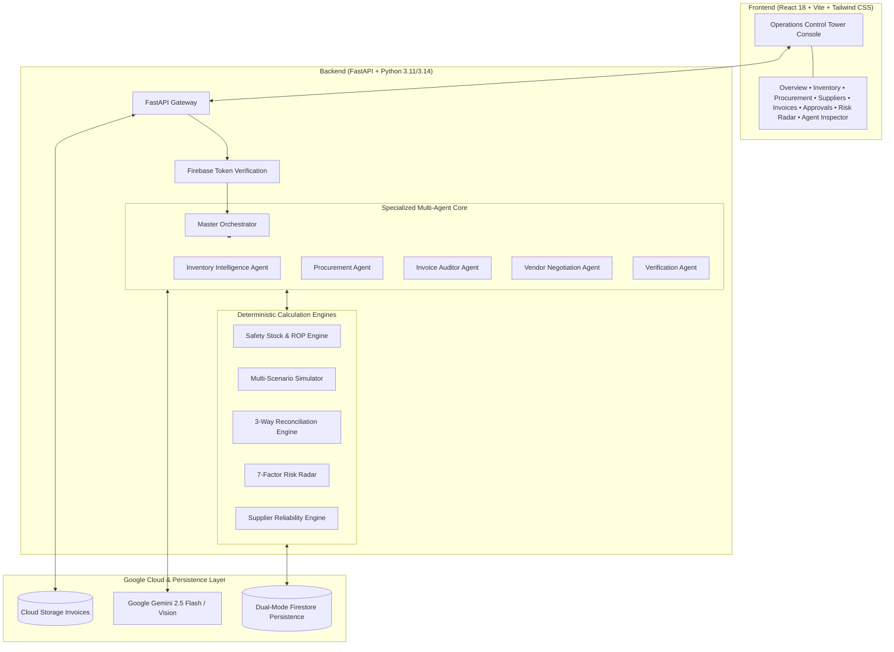

# LEADSTOHELP AI
### Autonomous Retail Supply Chain Intelligence & Procurement Operations Platform
> **Tagline:** *From supply-chain signals to verified business action.*

---

## 🌟 Executive Summary

**LEADSTOHELP AI** is an AI-Native Retail Operations Control Tower and Autonomous Closed-Loop Procurement Platform designed for small and medium businesses (SMEs), cloud kitchens, restaurants, artisanal cafés, bakeries, and neighbourhood retail merchants.

Instead of being a generic chatbot or basic dashboard with an LLM attached, **LEADSTOHELP AI** unifies disconnected inventory, supplier pricing, purchase orders, invoices, and delivery tracking into a **closed-loop operational workflow**:

$$\text{DETECT} \longrightarrow \text{INVESTIGATE} \longrightarrow \text{PREDICT} \longrightarrow \text{SIMULATE} \longrightarrow \text{RECOMMEND} \longrightarrow \text{NEGOTIATE} \longrightarrow \text{HUMAN APPROVAL} \longrightarrow \text{EXECUTE} \longrightarrow \text{VERIFY} \longrightarrow \text{LEARN}$$

---

## 🚀 Core Differentiators

### 1. 📡 Supply Risk Radar ($0\text{--}100$)
An operational risk engine that continuously calculates an explainable composite risk score across **7 supply chain dimensions**:
1. **Stockout Risk** (Forward run-rate vs. lead times)
2. **Excess Stock Risk** (Working capital lockup $>60$ days)
3. **Supplier Reliability Risk** (SLA breach frequencies)
4. **Price Volatility Risk** (Commodity price shifts)
5. **Invoice Discrepancy Risk** (Billing error frequency)
6. **Delivery Delay Risk** (Average transit variance)
7. **Budget & Cashflow Risk** (Spend vs. monthly caps)

### 2. 🛡️ Measured Supplier Reliability Score
Continuously calculated ratings based on actual application performance data:
* **On-time delivery percentage**
* **Invoice billing accuracy**
* **Price consistency**
* **Fulfillment rate**
* **Response time**
* **Historical negotiated savings**

### 3. ⚖️ Multi-Scenario Procurement Simulator
Before placing orders, the platform compares strategic alternatives:
* **Scenario A (Single Supplier):** Fast delivery, standard baseline pricing.
* **Scenario B (Split Order - AI Recommended):** Multi-source allocation combining immediate stockout buffer with bulk farm-direct volume pricing to maximize savings and eliminate single points of failure.
* **Scenario C (Delay Purchase / Just-In-Time):** Preserves immediate cashflow at the cost of high stockout probability.

### 4. 👁️ Multimodal Invoice Auditor & Discrepancy Engine
Combines **Google Gemini 2.5 Flash Vision OCR** with deterministic 3-way matching against Purchase Orders to detect 8 vectors of discrepancy (missing items, extra lines, quantity shortages, unit rate mismatches, and tax variances) and assigns traffic-light status (**GREEN / AMBER / RED**).

### 5. 🧑‍💼 Human-in-the-Loop Governance Barrier
Zero autonomous financial commitments without authorized manager approval. Every action is registered in an auditable Approval Queue with transparent dossiers (**What Will Happen**, **Why Recommended**, **Cost Impact**, **Expected Benefit**, and **Grounded Data Sources**).

---

## 🏗️ Architecture & Technology Stack



---

## ⚡ Quick Start Guide

### Prerequisites
* **Python 3.10+**
* **Node.js v18+** & **npm**
* **Docker** (optional for containerized deployment)

### 1. Backend Setup
```bash
# Navigate to backend
cd backend

# Install dependencies
python -m pip install -r requirements.txt

# Run deterministic data seeding (65 SKUs, 10 suppliers, 90-day sales history)
python ../scripts/seed_demo_data.py

# Run test suite (13/13 passing)
python -m pytest app/tests -v

# Start FastAPI server on port 8080
uvicorn app.main:app --host 0.0.0.0 --port 8080 --reload
```

### 2. Frontend Setup
```bash
# Navigate to frontend
cd frontend

# Install dependencies
npm install

# Run Vite dev server
npm run dev

# Or build for production
npm run build
```
Frontend runs at: `http://localhost:5173` (proxies API requests to backend on port 8080).

### 3. Docker Compose (1-Command Full-Stack Launch)
```bash
docker compose up --build
```
* **Frontend:** `http://localhost:3000`
* **Backend API & Swagger Docs:** `http://localhost:8080/docs`
* **Health Liveness Probe:** `http://localhost:8080/health`

---

## 🧪 Automated Test Verification

The backend includes a comprehensive pytest suite covering deterministic math, 3-way invoice matching, multi-scenario simulations, risk radar calculations, and multi-agent orchestrator pipelines:

```text
============================= test session starts =============================
collected 13 items

app/tests/test_api.py::test_health_endpoint PASSED                       [  7%]
app/tests/test_api.py::test_overview_endpoint PASSED                     [ 15%]
app/tests/test_api.py::test_inventory_list_and_details PASSED            [ 23%]
app/tests/test_api.py::test_procurement_simulator_endpoint PASSED        [ 30%]
app/tests/test_api.py::test_human_in_the_loop_approval_lifecycle PASSED  [ 38%]
app/tests/test_api.py::test_multimodal_invoice_audit_endpoint PASSED     [ 46%]
app/tests/test_api.py::test_master_agent_ask_stockout_flow PASSED        [ 53%]
app/tests/test_engines.py::test_inventory_math PASSED                    [ 61%]
app/tests/test_engines.py::test_scenario_simulator PASSED                [ 69%]
app/tests/test_engines.py::test_invoice_discrepancy_detection_perfect_match PASSED [ 76%]
app/tests/test_engines.py::test_invoice_discrepancy_detection_quantity_shortage PASSED [ 84%]
app/tests/test_engines.py::test_supply_risk_radar PASSED                 [ 92%]
app/tests/test_engines.py::test_supplier_reliability_scoring PASSED      [100%]

============================= 13 passed in 2.24s ==============================
```

---

## 🎬 3-Minute Demo Walkthrough

1. **Step 1 — Signal Detection:** Manager asks *"Will we run out of coffee beans this week?"*. Inventory Agent calculates run-rate ($13.0\text{ kg/day} + 32\%\text{ surge}$) and flags critical stockout in **2.8 days**.
2. **Step 2 — Scenario Simulation:** Procurement Agent simulates 3 strategic options; recommends **Scenario B (Split Order)** saving **₹8,672**.
3. **Step 3 — Target Negotiation:** Negotiation Agent generates target pricing (₹880/kg) and drafts supplier communication citing volume commitments.
4. **Step 4 — Human Approval Barrier:** Manager reviews explainable dossier in **Approval Center (APPR-2026-081)** and clicks **[Authorize & Execute]**.
5. **Step 5 — Multimodal Vision Audit:** Upload Kaveri Dairy invoice (`INV-KAV-8842`). Gemini Vision extracts 100L billed; 3-way matcher flags **8L shortage (₹486.40 overbilling)** with **RED** alert.
6. **Step 6 — Autonomous Resilience:** Primary supplier failure triggers automatic fallback re-route to secondary supplier with urgent approval request.

---

## 📄 License & Compliance
Built with ❤️ for SME Retail and Restaurant Supply Chains.  
Licensed under the Apache 2.0 License.
