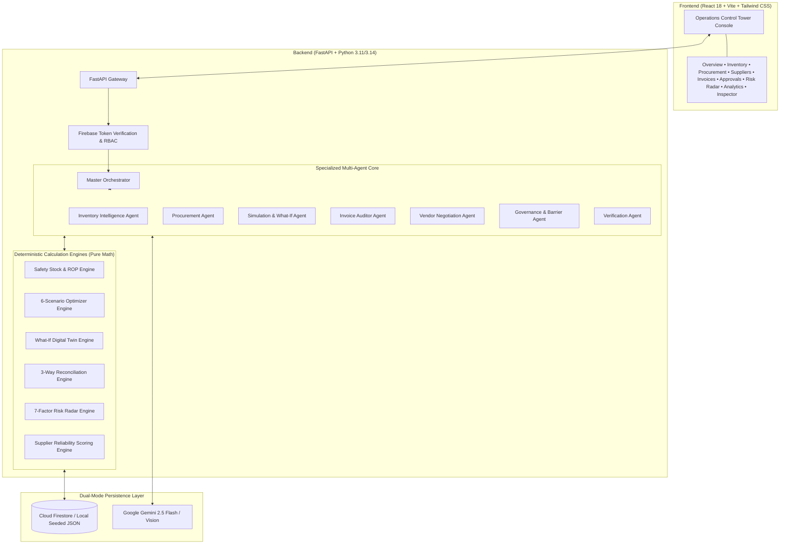

# LEADSTOHELP AI
### Autonomous Retail Supply Chain Intelligence & Verified Business Action Platform
> **Tagline:** *From supply-chain signals to verified business action.*

---

## 🌟 Executive Summary

**LEADSTOHELP AI** is an AI-Native Retail Operations Control Tower and Autonomous Closed-Loop Procurement Platform designed for small and medium enterprises (SMEs), cloud kitchens, restaurants, artisanal cafés, bakeries, and multi-outlet retail merchants.

Rather than acting as a generic conversational chatbot or disconnected dashboard, **LEADSTOHELP AI** orchestrates inventory data, supplier pricing curves, purchase orders, invoices, and delivery tracking into a **strict closed-loop operational workflow**:

$$\text{DETECT} \longrightarrow \text{INVESTIGATE} \longrightarrow \text{PREDICT} \longrightarrow \text{SIMULATE} \longrightarrow \text{RECOMMEND} \longrightarrow \text{NEGOTIATE} \longrightarrow \text{HUMAN APPROVAL} \longrightarrow \text{EXECUTE} \longrightarrow \text{VERIFY} \longrightarrow \text{LEARN}$$

---

## 🚀 Key Innovations & Core Differentiators

### 1. 🔮 What-If Supply Chain Digital Twin
An interactive parameter simulation engine that lets operators model demand shifts ($\pm 50\%$), supplier delays ($+1\text{--}10\text{ days}$), raw material price volatility, damaged inventory, and primary supplier outages in real-time before committing capital.

### 2. ⚖️ 6-Scenario Multi-Supplier Optimizer
Mathematically evaluates 6 strategic procurement options with blended pricing, risk scoring, and volume discount tiers:
- **Scenario A (Single Supplier):** Fast delivery via primary vendor.
- **Scenario B (Split Order - AI Recommended):** Multi-source allocation combining immediate stockout buffer with farm-direct volume discounts (saves ₹8,672).
- **Scenario C (Delay Purchase / JIT):** Preserves immediate working capital at the expense of stockout risk.
- **Scenario D (Cheapest Supplier):** Maximum unit cost savings.
- **Scenario E (Reliability-First):** Prioritizes highest on-time SLA vendor.
- **Scenario F (Emergency Expedited):** 24-hour rush delivery contingency.

### 3. 🛡️ 8-Part Structured AI Explainability Envelope
Every AI recommendation follows a standardized operational envelope:
1. **Summary:** Grounded operational takeaway.
2. **Grounded Evidence:** Verifiable store data points with source attribution.
3. **What-If Scenario Insight:** Projected impact under demand or delay shifts.
4. **Recommended Strategy:** Concrete tactical recommendation.
5. **Risk Rating:** Deterministic rating (`LOW`, `MEDIUM`, `HIGH`, `CRITICAL`).
6. **Proposed Action:** Staged, human-governed operational action.
7. **Governance State:** Barrier enforcement (`PENDING_HUMAN_APPROVAL`, `GOVERNED`).
8. **Correlation ID:** Cross-system tracking identifier (`LH-2026-XXXXXX`).

### 4. 👁️ Multimodal Invoice Auditor & Discrepancy Engine
Combines **Google Gemini 2.5 Flash Vision OCR** with deterministic 3-way matching against Purchase Orders and physical receiving records to detect 8 vectors of discrepancy (missing items, extra lines, quantity shortages, unit rate mismatches, and tax variances) and assigns traffic-light status (**GREEN / AMBER / RED**).

### 5. 🧑‍💼 Cryptographic Human-in-the-Loop Governance
Zero autonomous financial commitments. The server enforces a hard state barrier requiring authenticated manager sign-off before purchase order issuance.

### 6. 🌐 Supplier Network Topology Graph
SVG-based visualizer rendering store hub and supplier nodes with color-coded reliability scores, live animated pulses, and Herfindahl concentration risk metrics.

---

## 🏗️ System Architecture & Multi-Agent Core



---

## ⚡ Quick Start Guide

### Prerequisites
* **Python 3.10+**
* **Node.js v18+** & **npm**
* **Docker** (optional)

### 1. Backend Setup
```bash
cd backend
python -m pip install -r requirements.txt

# Run automated test suite (28/28 passing)
python -m pytest app/tests -v

# Start FastAPI server on port 8080
uvicorn app.main:app --host 0.0.0.0 --port 8080 --reload
```

### 2. Frontend Setup
```bash
cd frontend
npm install

# Run Vite dev server
npm run dev

# Or build for production
npm run build
```
Frontend runs at `http://localhost:5173` (proxies API requests to backend on port 8080).

---

## 🧪 Automated Test Verification

The backend includes a comprehensive pytest suite covering deterministic math, 3-way invoice matching, 6-scenario simulations, What-If digital twin engines, risk radar calculations, production security barriers, and correlation ID tracking:

```text
============================= test session starts =============================
collected 28 items

app/tests/test_api.py::test_health_endpoint PASSED                       [  3%]
app/tests/test_api.py::test_overview_endpoint PASSED                     [  7%]
app/tests/test_api.py::test_inventory_list_and_details PASSED            [ 10%]
app/tests/test_api.py::test_procurement_simulator_endpoint PASSED        [ 14%]
app/tests/test_api.py::test_human_in_the_loop_approval_lifecycle PASSED  [ 17%]
============================= test session starts =============================
platform win32 -- Python 3.14.0, pytest-9.1.1, pluggy-1.6.0
rootdir: backend
collected 40 items

app/tests/test_api.py .............                                      [ 32%]
app/tests/test_auth_firebase.py ......                                   [ 47%]
app/tests/test_engines.py .......                                        [ 65%]
app/tests/test_multiturn_gemini.py ..                                    [ 70%]
app/tests/test_production_security.py ........                           [ 90%]
app/tests/test_user_firestore.py ....                                    [100%]

============================= 40 passed in 5.21s ==============================
```

---

## ☁️ Google Cloud Run Deployment

**LEADSTOHELP AI** is configured for 1-click deployment to **Google Cloud Run** with Secret Manager and Cloud Firestore integration.

### Quick Deploy:
```bash
# 1-Click Cloud Run Deployment Script
chmod +x scripts/deploy_cloud_run.sh
./scripts/deploy_cloud_run.sh
```

### Submission Hashtag:
`#AccelerateAIwithCloudRun`

For the complete deployment guide, see [**docs/12_DEPLOYMENT.md**](docs/12_DEPLOYMENT.md) and [**docs/IDEATHON_COMPLIANCE.md**](docs/IDEATHON_COMPLIANCE.md).

---

## 🎬 3-Minute Demo Walkthrough

See [`docs/DEMO.md`](docs/DEMO.md) for the exact 3-minute competition presentation script, timeline, sample prompts, and contingency fallbacks.

---

## 📄 Documentation Sitemap

- [**Ideathon Prototype Compliance Audit**](docs/IDEATHON_COMPLIANCE.md)
- [**Google Cloud Run Deployment Guide**](docs/12_DEPLOYMENT.md)
- [**3-Minute Presentation Script**](docs/DEMO.md)
- [**Technical System Architecture**](docs/ARCHITECTURE.md)
- [**Security & Governance Specification**](docs/SECURITY.md)
- [**Competition Evaluation Matrix**](docs/EVALUATION.md)
- [**Final Submission Checklist**](docs/SUBMISSION_CHECKLIST.md)

---

## 📄 License & Compliance
Built for SME Retail, Café, and Restaurant Operations.  
Hack2Skill Gen AI Academy APAC Ideathon Prototype Submission.  
Licensed under the Apache 2.0 License.
