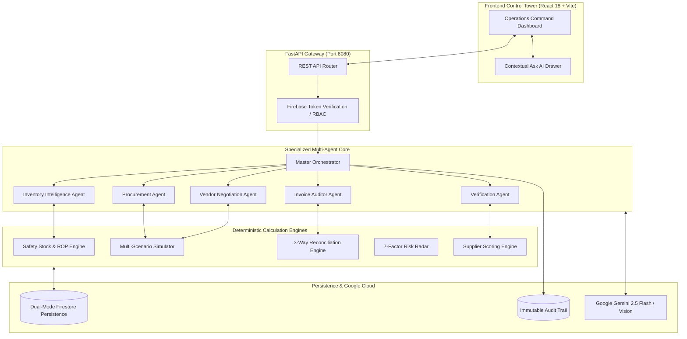

# 05 — Technical Architecture & Multi-Agent Topology

## 1. System Topology

---

## 2. Deterministic vs Generative Boundaries

* **Pure Python Deterministic Calculations (Zero-Hallucination):**
  * Safety Stock ($Z \times \sigma_d \times \sqrt{L}$) and Reorder Point ($(\bar{d} \times L) + \text{SS}$).
  * 8-Factor 3-way invoice reconciliation (quantity shortages, unit price inflation, GST tax computation).
  * Weighted multi-scenario order costs and volume discount tier applications.
  * 7-Factor Supply Risk Radar numerical aggregation ($0\text{--}100$).
  * Server-side authorization and RBAC permission checks.

* **Google Gemini 2.5 Flash / Vision (Language & Reasoning):**
  * Multi-agent intent classification and tool dispatching.
  * Multimodal OCR extraction from supplier invoice photographs.
  * Trade-off explanations between single vs split procurement scenarios.
  * Polite, professional vendor negotiation letter drafting citing volume tiers.
  * Plain-English operational risk summaries for business managers.
