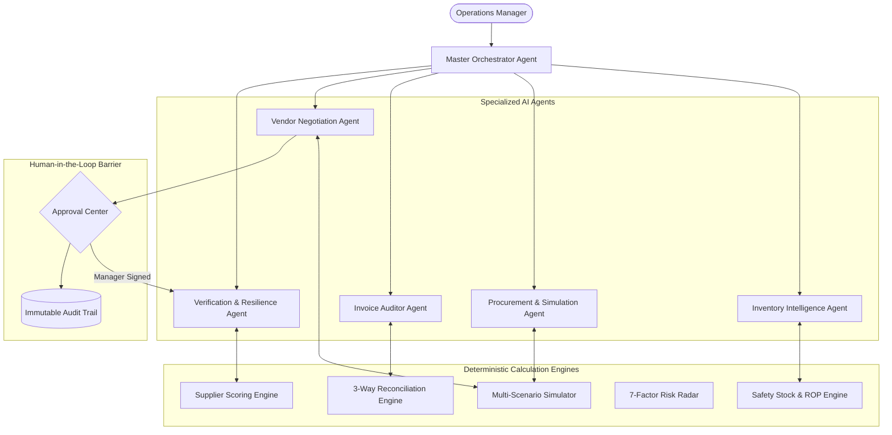

# LEADSTOHELP AI — System Architecture Specification

## 1. Executive Overview
**LEADSTOHELP AI** is an AI-Native Retail Operations Control Tower and Autonomous Procurement Platform designed for small and medium enterprises (SMEs), cloud kitchens, retail cafés, and neighbourhood merchants.

### Core Closed-Loop Lifecycle
$$\text{DETECT} \longrightarrow \text{INVESTIGATE} \longrightarrow \text{PREDICT} \longrightarrow \text{SIMULATE} \longrightarrow \text{RECOMMEND} \longrightarrow \text{NEGOTIATE} \longrightarrow \text{HUMAN APPROVAL} \longrightarrow \text{EXECUTE} \longrightarrow \text{VERIFY} \longrightarrow \text{LEARN}$$

---

## 2. Technology Stack & Google Cloud Services

| Layer | Technology / Service | Rationale & Responsibility |
| :--- | :--- | :--- |
| **Frontend** | React 18 + Vite + Tailwind CSS + Lucide | High-density operations command center with glassmorphic dashboards and live telemetry. |
| **Backend API** | FastAPI (Python 3.11/3.14) + Uvicorn | High-performance asynchronous API gateway and agent orchestration runtime. |
| **Agent Reasoning** | Google Gen AI SDK (`google-genai` / `gemini-2.5-flash`) | Conversational reasoning, multimodal invoice extraction, scenario explanation, and negotiation drafting. |
| **Deterministic Math** | Pure Python Arithmetic Modules | Safety stock, ROP, order quantities, price variances, discount curves, and tax computations. |
| **Persistence** | Google Cloud Firestore (Dual-Mode Engine) | Real-time state synchronization with seamless local transactional JSON fallback. |
| **Document Storage** | Google Cloud Storage (GCS) | Supplier invoice photographs, delivery challans, and audit artifacts. |
| **Security & Auth** | Firebase Authentication + RBAC Middleware | Server-side verified ID tokens and store tenancy boundaries. |
| **Deployment** | Google Cloud Run + Multi-stage Docker | Containerized auto-scaling execution listening on port 8080. |

---

## 3. Specialized Multi-Agent Layer

---

## 4. Deterministic vs. Generative Boundary

To guarantee zero financial hallucinations, **LEADSTOHELP AI** strictly separates deterministic calculations from generative AI capabilities:

* **Deterministic Python Code (Math & Rules):**
  * Safety Stock ($Z \times \sigma_d \times \sqrt{L}$) and Reorder Point ($(\bar{d} \times L) + \text{SS}$).
  * 3-way invoice reconciliation (quantity shortages, price variances, GST tax computation).
  * Weighted multi-scenario order costs and volume discount tier applications.
  * 7-Factor Supply Risk Radar numerical aggregation ($0\text{--}100$).
  * Server-side authorization and RBAC permission checks.
* **Google Gemini 2.5 Flash (Reasoning & Language):**
  * Intent classification and specialist agent dispatching.
  * Multimodal OCR extraction from supplier invoice photographs.
  * Trade-off explanations between single vs split procurement scenarios.
  * Polite, professional vendor negotiation letter drafting citing volume tiers.
  * Plain-English operational risk summaries for business managers.
