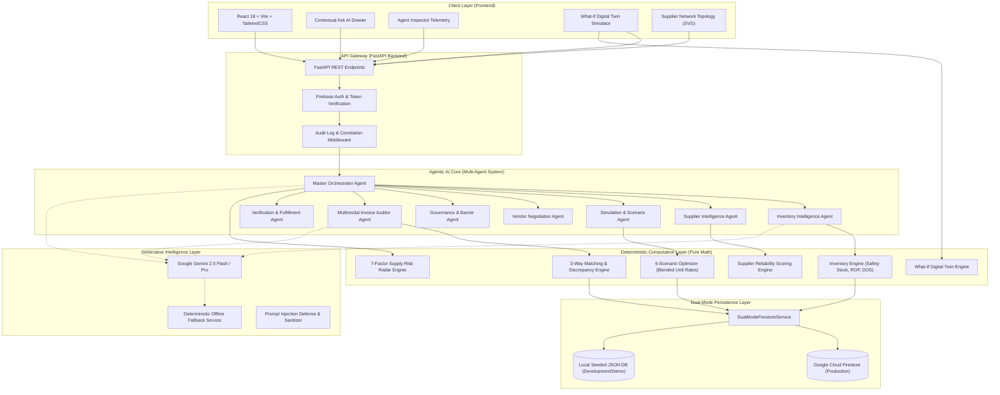
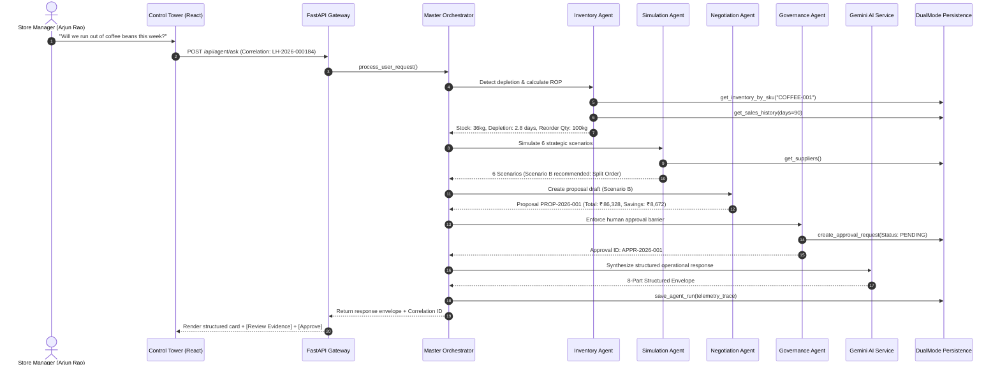

# LEADSTOHELP AI — Technical System Architecture

## 1. High-Level System Architecture Diagram

---

## 2. Multi-Agent Pipeline Execution Sequence

---

## 3. Core Architectural Principles

### A. Strict Separation: Arithmetic vs. Generative Reasoning
- **Deterministic Math**: Safety Stock, Reorder Point (ROP), Days of Supply (DOS), Price Tier Volume Discounts, Invoice Variances, and Supplier Reliability Scores are calculated **exclusively in pure Python mathematical engines**.
- **Generative AI**: Google Gemini is used **strictly for natural language synthesis, multimodal visual OCR/extraction, and strategic explainability**. Gemini is never asked to perform arithmetic.

### B. Dual-Mode Storage Architecture
- **Production Mode (`FIRESTORE_MODE=cloud`)**: Authenticates against live Google Cloud Firestore using Application Default Credentials (ADC) or Service Account keys with bound 8-second fast-fail probes.
- **Local/Demo Mode (`FIRESTORE_MODE=local`)**: Reads and writes to an in-memory, thread-safe JSON store initialized from `seeded_store_data.json`. Allows 100% offline, deterministic, zero-dependency competition demos.

### C. Cryptographic Human-in-the-Loop Governance
- High-impact operations (Purchase Order confirmation, vendor contract modifications, bank payment releases) cannot be executed directly by AI agents.
- The server rejects any state bypass and requires an explicit `POST /api/approvals/{id}/decision` signed by an authenticated manager token.

### D. End-to-End Traceability (Correlation IDs)
- Every workflow generates an immutable correlation identifier (e.g. `LH-2026-000184`).
- The correlation ID is propagated across all specialist agent steps, telemetry records, approval documents, and frontend drawers.
